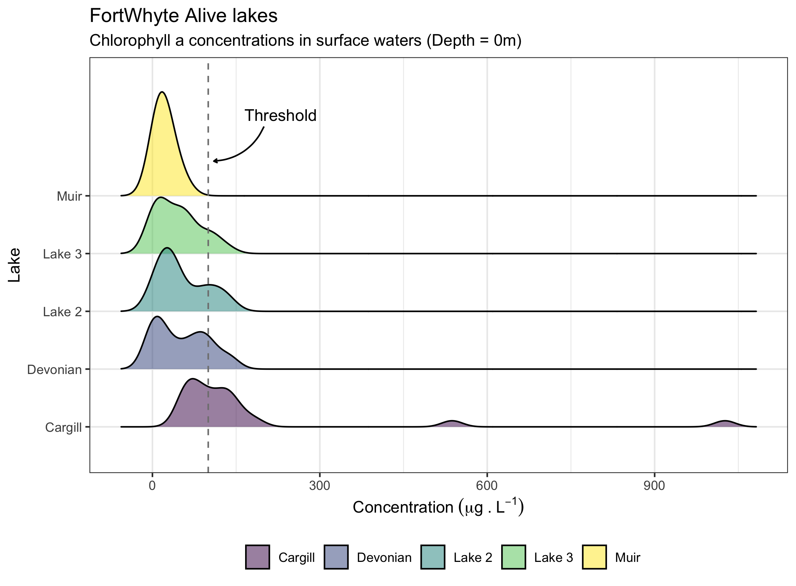

# Week 07 - Homework   {ggplot} part III

Welcome to your assignment for **week 7**. As usual, **Clone** this repo into your own :computer: using RStudio, as we saw in class.

For this week's assignment you will need to create a short **"report" in an rmarkdown** format with its associated `.md` and `.html` outputs.

## The data

For this week's assignment we are going to use a data set from the [**FortWhyte Alive Model Watershed Project**](http://lwbin-datahub.ad.umanitoba.ca/dataset/fortwhyte-alive). The data set contains measures of chlorophyll *a* measured in the model lakes at FortWhite Alive.

## Your tasks

1.  Using the chlorophyll data for surface waters (depth = 0 m ) try to replicate the figure below as close as possible. Use all the annotations and theme concepts we saw in class.

<!-- -->

## wrap-up

In addition to being shown in the final report, the final figure should be saved in `.pdf` format with a width of 190 mm

Finally, once you have completed the exercises, as usual:

-   Once you are done with the Rmarkdown files, save the changes, make sure scripts are properly saved in te **Rmarkdown** folder.
-   Commit all the changes to the *repo/R project* (remember to write a commit message!)
-   **Push** all changes back to **GitHub**
-   Go to GitHub and check that it all worked out

## A few hints

-   Make sure to save your `.rmd` file in the rmarkdown folder **before** you knit your file
-   You will need to use the **{here}** package to correctly load the ditch data into the `.Rmd` file as well as to save the figures.

As always, feel free to use the [Homework Issues](<https://github.com/orgs/UM-R-for-EnvSci-Fall-2022/discussions/categories/homework-issues>) section of the [discussion](<https://github.com/orgs/UM-R-for-EnvSci-Fall-2022/discussions>) section to reach out to your classmates if you have any questions. Remember that this is a way to practice how to engage in something like Stack Overflow or similar. I will be monitoring it, and if you are not getting any help, I'll jump in! Remember you can always tag me or any classmate in a comment for quicker replies!

Note for those of you **still waiting for a final Git/GitHub set up**. You can still use the green button labelled "code" to download a zip version of the repository. You can unzip this anywhere in your computer and open the R project by double clicking the blue cube .RProj file. then you will be able to work on the project, edit and save like you would on any other R project.The only difference, for now, is that you will not be able to "push" the changes back to github, as that folder is not being tracked by Git/GitHub. We will need to find a separate solution for you to get this folder back to me once you are done with the assignment (e.g. zip eail attachment or dropbox/google drive/onedrive link)

*Happy coding!*

Pepe
